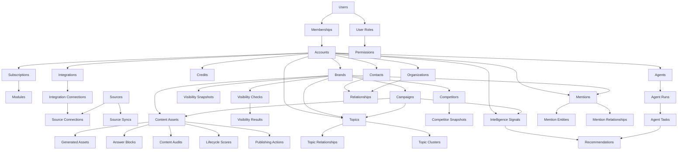

# Argusly Architecture Review

Date: 2026-05-29  
Reviewer: Principal Architect review

## 1. Architecture Score

**Score: 7.4 / 10**

Argusly has a strong foundation for a multi-tenant intelligence SaaS. The core tenant model, permission system, module entitlements, integrations, credits, content lifecycle, intelligence signals, topics, mentions, campaigns, relationships, sources and agents are all present as first-class concepts. The architecture is intentionally modular and service-oriented, which is the right direction for future AI visibility and agentic workflows.

The primary architectural risk is that the foundation is broad but not yet unified around a small set of canonical cross-domain abstractions. Several domains now solve similar problems independently: relationships, sources, topics, entity graph, integrations, mentions and signals each define their own relationship or source semantics. That is acceptable at foundation stage, but it will become expensive once real ingestion, scoring, automation and AI workflows arrive.

### Score Breakdown

| Area | Score | Notes |
| --- | ---: | --- |
| Tenant safety | 8.0 | Strong account and brand context. Most services scope explicitly. Some polymorphic and nullable-scope tables need stricter conventions. |
| Domain boundaries | 7.5 | Good product-level services. Boundaries are sometimes feature-page oriented rather than capability oriented. |
| Database design | 7.0 | Solid early schema. Needs more lifecycle, provenance, normalization and high-volume planning. |
| Naming consistency | 7.0 | Mostly clear. Some overlap between Sources, Integrations, Mentions source_id, Entities and Relationships. |
| Scalability | 6.8 | Good enough for foundation. High-volume visibility, mention, sync and agent data need partitioning/retention strategy. |
| Future AI visibility | 7.2 | Visibility checks/results/snapshots and sources are good starting points. Missing prompts, citations, answer entities and model-run abstractions. |
| Future influencer intelligence | 6.8 | Relationships and mentions help. Missing profile metrics, audience, platform handles and collaboration history. |
| Future relationship intelligence | 7.5 | Contacts, organizations and generic edges are strong. Needs dedupe, enrichment, roles and interaction timeline. |

## 2. Missing Concepts

### Cross-Domain Foundations

- **Canonical external identity**: A person, organization, source, social profile, integration account and mention author can all refer to the same real-world actor. Add an identity layer before real ingestion.
- **Universal activity/event stream**: `activity_logs` exists, but product events are not yet a durable domain event stream. Agent decisions, syncs, recommendations and status transitions need one event backbone.
- **Provenance and evidence**: Mentions, visibility results, recommendations, topics and scores need a consistent way to store why something exists, where it came from, confidence and source evidence.
- **Workflows and assignments**: Campaigns, recommendations, agents and publishing actions will eventually need owners, due dates, approvals, comments and task states.
- **Files/media assets**: Content and campaigns will need attachments, screenshots, citations, exports and generated media.
- **Notifications**: No notification preference or delivery model exists yet for alerts, signal changes, agent outcomes or failed syncs.
- **Data retention**: High-volume tables need retention policies before ingestion starts.
- **Audit trail for state changes**: Status-heavy models have timestamps, but most do not record transition history.

### AI Visibility

Missing concepts for a robust AI visibility implementation:

- **Prompt/query library**: Visibility checks currently store provider and query. Future checks need prompt variants, locale, market, persona, device/context and intent.
- **Model/provider run abstraction**: AI responses from ChatGPT, Claude, Gemini, Perplexity and Google AI Overviews should be stored as runs with provider, model, parameters, latency, token/cost metadata and raw payload.
- **Citations and answer sources**: AI visibility requires citation URLs, source domains, ranking, snippets and source trust.
- **Answer entities**: Store mentioned brands, competitors, topics, products and people detected in responses.
- **Share of answer / share of voice**: Current scores are placeholders. Add normalized metric tables rather than only storing JSON payloads.
- **SERP and AI answer separation**: Search results and AI-generated answers behave differently and should not be forced into one result shape.

### Influencer Intelligence

Missing concepts for influencer intelligence:

- **Social profiles**: Contacts and organizations need platform-specific handles, URLs, follower counts, engagement rate, audience geography and profile status.
- **Audience snapshots**: Follower and engagement metrics need time-series storage.
- **Creator/influencer classification**: `relationships.relationship_type = influencer` is a useful edge, but influencer is also a profile role with metrics.
- **Collaboration records**: Campaign participation, outreach, offers, deliverables, posts and performance should be first-class.
- **Media kit and rate cards**: Store structured collaboration terms later.
- **Brand safety signals**: Mentions, sentiment, past controversies and topic alignment should feed influencer scoring.

### Relationship Intelligence

Missing concepts for relationship intelligence:

- **Interactions**: Calls, emails, meetings, notes, outreach attempts and replies.
- **Roles and tags**: A contact can be journalist, analyst and influencer simultaneously. Edges alone are not enough.
- **Dedupe and merge**: Contacts and organizations need duplicate detection and merge history.
- **Ownership**: Assign relationship owners inside the account.
- **Consent and compliance**: Email, phone and LinkedIn data will need consent/status fields before production CRM use.

## 3. Future Risks

### Risk 1: Relationship Semantics Fragmentation

Argusly currently has multiple relationship systems:

- `entity_relationships`
- `topic_relationships`
- `mention_relationships`
- `relationships`
- `campaign_*` pivots
- `topicables`

This is workable now, but future graph features may have to join across several incompatible edge models. The risk is duplicated graph logic, inconsistent labels and hard-to-debug tenant boundaries.

### Risk 2: Source vs Integration Ambiguity

Integrations represent connection capability. Sources represent ingestion lanes. Mentions currently still use `source_id` pointing to `integration_connections`, while the new Source Registry uses `sources`. This is a known transition point. If not resolved before real ingestion, mention filtering, provenance and sync history will split across two meanings of "source".

### Risk 3: JSON Metadata Becoming the Product Schema

Many tables include `metadata`. That is useful for foundation work, but without promotion rules, critical product data may hide in JSON and become hard to index, validate, migrate and report on.

### Risk 4: High-Volume Tables Are Not Yet Designed for Volume

These tables could become very large:

- `mentions`
- `visibility_results`
- `visibility_snapshots`
- `source_syncs`
- `intelligence_signals`
- `agent_runs`
- `agent_tasks`
- `activity_logs`

Current indexing is fine for early use, but retention, rollups, partitioning and archival are not yet defined.

### Risk 5: Agent Architecture Can Outgrow Synchronous Services

Agents will eventually coordinate content, campaigns, recommendations, sources, topics and relationships. If agents call services directly without a durable command/event layer, retries, idempotency and auditability will become difficult.

### Risk 6: Permission Model May Become Too Coarse

Permissions are currently module/action oriented, such as `view_campaigns` and `manage_account`. Source Registry currently uses `manage_account`, which is acceptable for foundation but too broad long term. Future operators may need to manage sources without managing billing, users or account settings.

## 4. Recommended Refactors

### Refactor 1: Introduce Domain Modules

Keep Laravel structure, but organize services and policies by domain namespace:

- `App\Domain\Tenancy`
- `App\Domain\Content`
- `App\Domain\Intelligence`
- `App\Domain\Visibility`
- `App\Domain\Topics`
- `App\Domain\Mentions`
- `App\Domain\Campaigns`
- `App\Domain\Relationships`
- `App\Domain\Sources`
- `App\Domain\Agents`

This does not require a large rewrite. Start by moving new service classes when they become more complex.

### Refactor 2: Create Shared Tenant Query Helpers

Many services implement similar account/brand visibility rules:

- account-only
- account plus current brand
- global plus account plus brand
- nullable brand scope

Create reusable query scopes or a `TenantScopeBuilder` helper for consistency. Keep explicit service scoping, but centralize the patterns.

### Refactor 3: Split Sources From Integrations Clearly

Define the contract:

- **Integration**: external provider capability and credentials.
- **Source**: configured data stream or corpus to monitor.
- **SourceConnection**: link between source and credential.
- **SourceSync**: execution record for ingestion.

Then migrate mentions to reference `sources.id` instead of `integration_connections.id`, or add a separate `source_registry_id` field and deprecate the old meaning.

### Refactor 4: Create a Unified Relationship/Graph Abstraction

Do not merge all relationship tables immediately. Instead, define a read model:

- `GraphNode`
- `GraphEdge`
- `GraphProjectionService`

Project topics, entities, contacts, organizations, campaigns and mentions into one graph interface for graph UI, recommendations and agents.

### Refactor 5: Promote Critical Metadata

Create a rule: metadata may hold provider-specific or experimental data, but anything used for filtering, permissions, scoring, billing or dashboards must become a typed column or child table.

## 5. Database Improvements

### Tenant and Scope Columns

- Standardize on `account_id` for all tenant-owned rows.
- Use `brand_id nullable` only when account-level data is valid.
- Avoid nullable `account_id` unless data is truly global catalog data.
- For global/account/brand records like topics and sources, add explicit `scope` or derive it consistently in service methods.

### Polymorphic Tables

Polymorphic relationships are useful, but tenant safety relies on service validation. For high-risk polymorphic tables:

- `topicables`
- `mention_relationships`
- `relationships`
- `activity_logs`
- `credit_transactions`

Add or retain `account_id` and, when useful, `brand_id` on the polymorphic table itself. This improves tenant filtering and makes cleanup easier.

### Status Columns

Many status columns are strings. That is fine for Laravel, but add conventions:

- Every status enum should live on the model.
- Every service should validate status transitions.
- Important state changes should be recorded in a history/event table.

### Indexing

Add or review composite indexes before real ingestion:

- `mentions(account_id, brand_id, source_id, published_at)`
- `mentions(account_id, brand_id, sentiment, published_at)`
- `visibility_results(account_id, brand_id, provider, captured_at)`
- `visibility_results(visibility_check_id, captured_at)`
- `source_syncs(source_id, status, started_at)`
- `intelligence_signals(account_id, brand_id, status, priority, detected_at)`
- `recommendations(account_id, brand_id, status, impact_score)`
- `agent_runs(account_id, brand_id, status, started_at)`
- `relationships(account_id, relationship_type, strength)`

### Cascades and Deletes

Most foundation tables use cascade deletes. That is convenient for tests and early development, but production may need soft deletes or archival for:

- content assets
- campaigns
- mentions
- visibility results
- relationships
- sources
- integration connections

Tenant deletion can cascade. User/product-level deletion should usually be soft or archived.

### Data Volume Strategy

Before real sync and AI visibility launch:

- Define retention for raw provider payloads.
- Create rollup tables for daily visibility, sentiment and source metrics.
- Consider monthly partitioning for mentions, visibility results and source syncs if using MySQL partitioning or a warehouse later.
- Decide which data remains OLTP and which moves to analytics storage.

## 6. Service Layer Improvements

### Current Strengths

- Controllers are mostly thin.
- Services accept account and brand context explicitly.
- Services validate cross-tenant relationships.
- Domain services are easy to test.

### Improvements

1. **Introduce DTOs or Form Objects**

   Many services accept loose arrays. This is pragmatic, but it weakens contracts as domains grow. Add request DTOs for important operations:

   - create/update campaign
   - create source
   - create mention
   - create visibility check
   - create relationship edge
   - run agent task

2. **Separate Query Services From Command Services**

   Some services do both dashboard queries and mutations. Split when complexity rises:

   - `CampaignCommandService`
   - `CampaignQueryService`
   - `SourceRegistryCommandService`
   - `SourceRegistryQueryService`

3. **Add Policy Coverage Beyond Content**

   Content assets and answer blocks have policies. Campaigns, topics, mentions, sources and relationships currently rely mostly on gates in controllers and service scoping. Add policies for high-value records once workflows mature.

4. **Standardize Tenant Assertion Helpers**

   Many services implement `ensureBrandBelongsToAccount`. Centralize it in a small shared service or trait.

5. **Define Idempotency for Async Work**

   Publishing, content generation, audits and future source syncs need idempotency keys. This becomes critical when queues retry.

## 7. Event Architecture Improvements

### Current State

Argusly has signal producer services and a `SignalManager` that can create `IntelligenceSignal` records from product events. This is a good start, but it is not yet a full event architecture.

### Recommended Event Layers

1. **Domain Events**

   Immutable in-process events emitted by services:

   - `ContentAssetPublished`
   - `MentionCaptured`
   - `VisibilityCheckCompleted`
   - `SourceSyncCompleted`
   - `CampaignActivated`
   - `RecommendationAccepted`
   - `AgentRunCompleted`

2. **Event Store / Activity Timeline**

   Keep durable events in a table separate from `activity_logs`:

   - `domain_events`
   - account_id
   - brand_id nullable
   - event_type
   - subject_type
   - subject_id
   - payload
   - occurred_at
   - processed_at nullable

3. **Projectors**

   Project domain events into:

   - intelligence signals
   - recommendations
   - activity logs
   - dashboards
   - notification jobs
   - agent task queues

4. **Outbox Pattern**

   Before external integrations and agent automation, add an outbox table for reliable external calls and async dispatch.

### Why This Matters

Future AI visibility and influencer intelligence will be ingestion-heavy. A durable event spine makes retry, dedupe, audit and agent reasoning much safer.

## 8. Suggested Domain Diagram

## Priority Roadmap

### Next 30 Days

1. Normalize Source Registry and Mention source semantics.
2. Add domain events and event projectors for existing content, visibility, source and campaign flows.
3. Add policies for sources, campaigns, topics, mentions and relationships.
4. Define AI visibility result schema for provider runs, citations and answer entities.

### Next 60 Days

1. Introduce graph projection service across topics, relationships, campaigns, mentions and brand entities.
2. Add interaction timeline for contacts and organizations.
3. Add source sync command model and outbox pattern.
4. Add score history tables for visibility, sentiment, influence and recommendation impact.

### Next 90 Days

1. Build AI visibility ingestion workers with idempotency and provider adapters.
2. Build influencer profile layer on top of contacts, organizations, sources and mentions.
3. Add analytics rollups and retention policies for mentions, visibility results and syncs.
4. Add agent orchestration around events, tasks, approvals and recommendations.

## Final Assessment

Argusly is on a strong trajectory. The architecture is intentionally broad, tenant-aware and modular. The main issue is not missing tables; it is the need to converge the growing number of foundation concepts into a few canonical primitives before ingestion and automation make the system harder to reshape.

The most important next architectural move is to create a durable event spine and a unified source/provenance model. Once those are in place, AI visibility, influencer intelligence and relationship intelligence can scale without turning every new provider into a one-off integration path.
